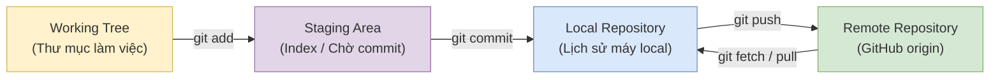

# HC-TC Office — Quy tắc Quản lý Mã nguồn với Git & GitHub

Tài liệu này quy định các nguyên tắc, khái niệm nền tảng, quy trình thao tác và chuẩn hóa Git/GitHub trong dự án **HC-TC Office**.

Mục tiêu:

- bảo vệ tính toàn vẹn mã nguồn;
- duy trì lịch sử commit rõ ràng;
- bảo đảm khả năng truy xuất nguồn gốc (Traceability);
- hỗ trợ phát triển cá nhân, AI-assisted development và phát triển nhóm;
- giảm nguy cơ mất dữ liệu hoặc đưa mã nguồn lỗi lên repository;
- bảo vệ Secret và thông tin nhạy cảm.

---

## 1. Khái niệm nền tảng

### 1.1. Git là gì?

Git là hệ thống quản lý phiên bản phân tán (**Distributed Version Control System - DVCS**) giúp theo dõi sự thay đổi của mã nguồn theo thời gian.

Git cho phép:

- lưu lịch sử thay đổi;
- xem ai và khi nào thay đổi;
- khôi phục phiên bản trước;
- tạo và quản lý branch;
- làm việc độc lập trên máy local;
- phối hợp nhiều Developer/AI mà hạn chế ghi đè công việc.

---

### 1.2. Phân biệt Git và GitHub

**Git**:

- là công cụ quản lý phiên bản;
- chạy trên máy tính local;
- quản lý repository, commit, branch và history;
- có thể sử dụng khi không có Internet.

**GitHub**:

- là dịch vụ lưu trữ và cộng tác dựa trên Git;
- lưu Remote Repository;
- hỗ trợ Pull Request;
- Issue;
- Code Review;
- Actions/CI/CD;
- quản lý quyền truy cập và cộng tác nhóm.

> Git và GitHub không phải là một khái niệm.

---

### 1.3. Local Repository và Remote Repository

**Local Repository**:

- nằm trên máy tính đang phát triển;
- chứa lịch sử commit;
- có thể có nhiều branch;
- có thể commit khi không có Internet.

**Remote Repository**:

- repository nằm trên GitHub hoặc một Git server;
- trong dự án hiện tại được cấu hình với remote có tên `origin`;
- dùng để đồng bộ và cộng tác.

> Trong dự án HC-TC Office, GitHub là nơi lưu trữ mã nguồn từ xa và hỗ trợ backup/cộng tác. Không nên mặc định rằng Remote luôn là "nguồn sự thật tuyệt đối"; trạng thái chuẩn cần được xác định theo quy trình branch/review của dự án.

---

## 2. Mô hình luồng dữ liệu Git

Mọi thành viên và AI Assistant phải hiểu rõ các trạng thái chính của Git:



### 2.1. Working Tree

Working Tree là thư mục dự án mà Developer trực tiếp làm việc.

Tại đây có thể:

- tạo file;
- sửa file;
- xóa file;
- chạy ứng dụng;
- chạy test/lint/build.

Các thay đổi chưa được `git add` vẫn chỉ nằm trong Working Tree.

---

### 2.2. Staging Area

Staging Area là vùng chuẩn bị cho commit.

Ví dụ:

```bash
git add src/App.tsx
```

Sau lệnh này, thay đổi của `src/App.tsx` được đưa vào Staging Area.

Có thể kiểm tra bằng:

```bash
git status
```

và:

```bash
git diff --staged
```

---

### 2.3. Commit

Commit là một snapshot của trạng thái được đưa vào Staging Area tại thời điểm commit.

Mỗi commit có:

- commit hash;
- author;
- timestamp;
- commit message;
- snapshot của repository.

Ví dụ:

```bash
git commit -m "feat(task-09): implement leader list"
```

---

## 3. Quy tắc quản lý Branch

### 3.1. Nhánh `main`

`main` là nhánh chính của dự án.

Code trên `main` cần bảo đảm:

- không có lỗi build;
- không có lỗi lint;
- không chứa Secret;
- không chứa file rác;
- thay đổi phải có TASK hoặc lý do hợp lệ;
- lịch sử commit phải có thể truy xuất.

### 3.2. Giai đoạn phát triển cá nhân

Trong giai đoạn hiện tại, dự án được phát triển cá nhân và có thể thực hiện TASK trực tiếp trên `main` theo quy trình đã quy định trong:

`docs/00-project/04-task-management.md`

### 3.3. Khi chuyển sang phát triển nhóm

Khi dự án có nhiều Developer/AI cùng làm việc, ưu tiên sử dụng branch riêng.

Tên branch:

```text
feature/task-id-short-description
```

Ví dụ:

```text
feature/task-09-leader-list
```

Branch sửa lỗi:

```text
fix/task-id-bug-description
```

Ví dụ:

```text
fix/task-15-date-parsing-error
```

---

## 4. Quy chuẩn Commit

### 4.1. Atomic Commit

Một commit nên đại diện cho một đơn vị thay đổi có ý nghĩa.

Nguyên tắc:

- không gom các thay đổi hoàn toàn không liên quan;
- không commit file rác;
- không commit Secret;
- không commit code đang ở trạng thái lỗi nếu commit được xem là mốc hoàn chỉnh;
- commit phải có thể truy xuất về TASK tương ứng.

Trong quy trình nghiệm thu TASK của dự án, có thể staging toàn bộ thay đổi thuộc TASK và tạo một commit hoàn chỉnh.

---

### 4.2. Commit Message

Format chuẩn:

```text
<type>(<scope>): <short summary in lowercase>
```

Ví dụ:

```text
docs(task-04): complete project documentation
```

```text
feat(task-09): implement leader list
```

```text
fix(task-15): resolve date parsing error
```

### 4.3. Các `type` được sử dụng

| Type       | Ý nghĩa                    |
| ---------- | -------------------------- |
| `feat`     | Thêm chức năng             |
| `fix`      | Sửa lỗi                    |
| `docs`     | Tài liệu                   |
| `style`    | Chỉ thay đổi formatting    |
| `refactor` | Tái cấu trúc code          |
| `test`     | Test                       |
| `chore`    | Cấu hình, package, tooling |

### 4.4. Quy tắc viết message

Commit message cần:

- ngắn gọn;
- mô tả đúng thay đổi;
- viết bằng tiếng Anh;
- summary viết lowercase;
- có TASK ID khi thay đổi thuộc TASK.

Không sử dụng message mơ hồ như:

```text
update
fix
change
test
abc
new code
```

---

## 5. Git Command Reference

### 5.1. `git status`

Dùng để kiểm tra trạng thái repository:

```bash
git status
```

Cho biết:

- branch hiện tại;
- file modified;
- file untracked;
- file staged;
- trạng thái so với remote.

Nên chạy:

```text
trước khi thao tác
        ↓
thực hiện thay đổi
        ↓
kiểm tra lại
        ↓
commit
```

---

### 5.2. `git diff`

Xem thay đổi chưa được staging:

```bash
git diff
```

Dùng để kiểm tra:

> Tôi vừa sửa những gì?

---

### 5.3. `git diff --staged`

Xem chính xác những gì sẽ được commit:

```bash
git diff --staged
```

Đây là bước kiểm tra rất quan trọng trước `git commit`.

Dùng để trả lời:

> Tôi sắp commit những gì?

---

### 5.4. `git add`

Thêm file cụ thể:

```bash
git add docs/00-project/06-git-github-rules.md
```

Thêm cả thư mục:

```bash
git add docs/00-project/
```

Có thể sử dụng:

```bash
git add .
```

nhưng phải kiểm tra `git status` trước để tránh staging nhầm file.

---

### 5.5. `git commit`

Tạo commit:

```bash
git commit -m "docs(task-04): complete project documentation"
```

Commit chỉ được tạo từ nội dung đã nằm trong Staging Area.

---

### 5.6. `git push`

Đẩy commit local lên remote:

```bash
git push origin main
```

Hoặc với branch:

```bash
git push origin feature/task-09-leader-list
```

---

### 5.7. `git pull`

Cập nhật repository local:

```bash
git pull origin main
```

Khi làm việc nhóm, cần đồng bộ branch trước khi bắt đầu hoặc trước khi merge/push theo quy trình của nhóm.

---

### 5.8. `git fetch`

Tải thông tin mới từ remote nhưng không tự động merge vào Working Tree:

```bash
git fetch origin
```

`fetch` hữu ích khi muốn kiểm tra trạng thái remote trước khi quyết định merge/rebase/pull.

---

## 6. Xử lý Conflict

Conflict có thể xảy ra khi Git không thể tự động kết hợp các thay đổi.

Ví dụ Git có thể đánh dấu:

```text
code A
```

### Quy trình

1. Xác định file conflict.
2. Mở file.
3. Đọc cả hai phiên bản.
4. Xác định logic đúng.
5. Xóa các marker conflict.
6. Kiểm tra code.
7. Chạy:

```bash
npm run lint
```

8. Chạy:

```bash
npm run build
```

9. Stage file:

```bash
git add <file-name>
```

10. Hoàn tất merge theo trạng thái Git yêu cầu.

> Không được chọn code một cách máy móc chỉ vì Git hoặc AI đề xuất. Phải hiểu logic nghiệp vụ trước khi giải quyết conflict.

---

## 7. `.gitignore` và bảo mật

### 7.1. `.gitignore`

Các file/thư mục không nên đưa lên Git cần được cấu hình trong `.gitignore`.

Ví dụ:

```gitignore
# Dependencies
node_modules/

# Build outputs
dist/
build/

# Environment & Secrets
.env
.env.local
.env.*.local

# IDE & System files
.vscode/
.DS_Store
*.log
```

Không tự động thêm mọi file vào `.gitignore`. Chỉ ignore những file thực sự không cần quản lý bằng Git.

---

### 7.2. Secret

Tuyệt đối không commit:

- API Key;
- Password;
- Access Token;
- Refresh Token bí mật;
- Private Key;
- Service Account Key;
- Database password;
- thông tin xác thực nhạy cảm.

Nếu Secret đã bị commit lên remote:

1. Thu hồi Secret.
2. Rotate/tạo Secret mới.
3. Kiểm tra phạm vi ảnh hưởng.
4. Xử lý lịch sử Git nếu cần.
5. Kiểm tra repository lại.
6. Không coi việc xóa file ở commit mới là đã xử lý xong Secret.

---

## 8. GitHub — Pull Request và Code Review

Khi dự án chuyển sang phát triển nhóm:

1. Developer tạo feature/fix branch.
2. Hoàn thành TASK.
3. Chạy kiểm tra.
4. Push branch lên GitHub.
5. Tạo Pull Request vào `main`.
6. Mô tả:
   - TASK ID;
   - mục tiêu;
   - thay đổi;
   - kết quả test;
   - ảnh chụp nếu cần.

7. Code Review.
8. CI/CD kiểm tra nếu dự án có cấu hình.
9. Merge khi đáp ứng quy định của dự án.

Trong giai đoạn cá nhân, quy trình có thể được đơn giản hóa nhưng vẫn phải giữ nguyên các nguyên tắc:

- kiểm tra code;
- kiểm tra build;
- kiểm tra diff;
- commit rõ ràng;
- push;
- cập nhật documentation/progress.

---

## 9. Recovery Protocol

### 9.1. Hủy thay đổi chưa staged

```bash
git restore <file-name>
```

Lệnh này loại bỏ thay đổi của file trong Working Tree.

> Phải sử dụng cẩn thận vì thay đổi chưa commit có thể bị mất.

---

### 9.2. Unstage file

```bash
git restore --staged <file-name>
```

Lệnh này đưa file ra khỏi Staging Area nhưng giữ nguyên thay đổi trong Working Tree.

---

### 9.3. Sửa commit message gần nhất

Chỉ nên sử dụng khi commit chưa push:

```bash
git commit --amend -m "docs(task-04): correct commit message"
```

Không tùy tiện sửa lịch sử của commit đã được người khác sử dụng.

---

### 9.4. Revert commit đã push

Khi cần hoàn tác một commit đã được chia sẻ:

```bash
git revert <commit-hash>
```

`git revert` tạo một commit mới để đảo ngược thay đổi thay vì xóa lịch sử cũ.

---

### 9.5. Cẩn trọng với `git reset`

Các lệnh `git reset` có thể làm thay đổi lịch sử hoặc trạng thái staging/working tree.

Không sử dụng `reset --hard` nếu chưa hiểu rõ hậu quả.

---

## 10. Quy trình Git theo vòng đời TASK

Khi TASK đạt bước Git trong `04-task-management.md`, thực hiện:

```text
git status
      ↓
Kiểm tra kết quả TASK
      ↓
npm run lint
      ↓
npm run build
      ↓
git add <file>
      ↓
git diff --staged
      ↓
git commit
      ↓
git status
      ↓
git push
      ↓
git status
```

Sau cùng cần xác nhận:

```text
Working Tree clean
```

và branch đã đồng bộ với remote khi quy trình yêu cầu.

---

## 11. Checklist Git trước khi PASS TASK

### Repository

- [ ] Đang ở đúng branch.
- [ ] Không có file không liên quan.
- [ ] Không có file rác.
- [ ] `.gitignore` hoạt động đúng.

### Code

- [ ] `npm run lint` PASS.
- [ ] `npm run build` PASS.
- [ ] Không có Secret.

### Staging

- [ ] `git status` đã được kiểm tra.
- [ ] `git diff --staged` đã được kiểm tra.
- [ ] Chỉ staging các file thuộc TASK.

### Commit

- [ ] Commit message đúng format.
- [ ] Có TASK ID khi áp dụng.
- [ ] Nội dung commit phản ánh đúng thay đổi.

### Remote

- [ ] Commit đã push nếu TASK yêu cầu.
- [ ] `git status` cuối cùng được kiểm tra.
- [ ] Không còn thay đổi ngoài ý muốn.

---

## 12. Quan hệ với các tài liệu khác

Tài liệu này tập trung vào **Git/GitHub và quản lý mã nguồn**.

Các nội dung khác được quy định tại:

- `04-task-management.md` — quản lý vòng đời TASK và Definition of Done.
- `05-development-rules.md` — quy tắc phát triển code.
- `07-documentation-rules.md` — quy tắc quản lý tài liệu.
- `08-progress.md` — theo dõi tiến độ TASK/Phase.

Không lặp lại toàn bộ quy trình của các tài liệu trên trong tài liệu này.

---

## 13. Nguyên tắc cuối cùng

> **Không commit những gì mình chưa kiểm tra.**
>
> **Không push những gì mình chưa hiểu.**
>
> **Không đưa Secret vào Git.**
>
> **Mỗi thay đổi phải có thể truy xuất về lý do và TASK tương ứng.**

Git không chỉ là công cụ lưu code.

Git là **lịch sử phát triển của dự án**.
