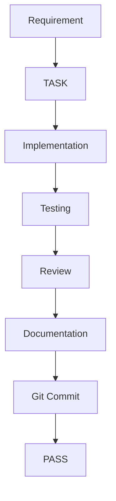

# HC-TC Office — Documentation Rules

## 1. Mục đích

Tài liệu này quy định nguyên tắc, cấu trúc, cách biên soạn, cập nhật, kiểm tra và quản lý toàn bộ tài liệu của dự án **HC-TC Office**.

Mục tiêu:

- Đảm bảo tài liệu chính xác và đồng bộ với hệ thống thực tế.
- Giúp thành viên mới có thể nhanh chóng hiểu dự án.
- Giúp AI Assistant có đủ ngữ cảnh để tiếp tục phát triển dự án.
- Tránh tài liệu trùng lặp, mâu thuẫn hoặc lỗi thời.
- Đảm bảo mỗi thay đổi quan trọng trong dự án có khả năng truy vết.
- Xem tài liệu là một phần chính thức của quy trình phát triển, không phải công việc phụ sau khi coding.

---

## 2. Phạm vi áp dụng

Quy tắc này áp dụng cho toàn bộ tài liệu thuộc dự án HC-TC Office, bao gồm:

- Project documentation.
- Requirements.
- Roadmap.
- TASK documentation.
- Development rules.
- Git/GitHub rules.
- Documentation rules.
- Progress tracking.
- Technical decisions.
- Architecture documentation.
- API documentation.
- Database documentation.
- Testing documentation.
- Deployment documentation.
- User documentation.
- Các tài liệu phục vụ AI Assistant.

---

## 3. Nguyên tắc quản lý tài liệu

### 3.1. Documentation is part of Definition of Done

Một TASK không được coi là hoàn thành nếu phần tài liệu bắt buộc của TASK chưa được cập nhật.

Quy trình tổng quát:

```text
Requirement
    ↓
Analysis
    ↓
Implementation
    ↓
Self-Test
    ↓
AI/Mentor Review
    ↓
Documentation
    ↓
Git Commit
    ↓
Progress Update
    ↓
TASK PASS
```

Tài liệu là một phần của quá trình phát triển và nghiệm thu.

---

### 3.2. Single Source of Truth

Mỗi thông tin quan trọng của dự án phải có **một nguồn chính thức** để xác định trạng thái hoặc nội dung chuẩn.

Các tài liệu khác có thể:

- Tóm tắt.
- Tham chiếu.
- Liên kết đến nguồn chính thức.

Không được tạo nhiều phiên bản độc lập của cùng một thông tin quan trọng dẫn đến khả năng mâu thuẫn.

Ví dụ:

- TASK Status → `08-progress.md`.
- TASK Workflow → `04-task-management.md`.
- Coding Rules → `05-development-rules.md`.
- Git Rules → `06-git-github-rules.md`.
- Documentation Rules → `07-documentation-rules.md`.
- Project Overview → `01-project-overview.md`.
- Requirements → `02-requirements.md`.
- Roadmap → `03-roadmap.md`.

---

### 3.3. Tính chính xác

Tài liệu phải phản ánh chính xác trạng thái thực tế của hệ thống trong phạm vi tài liệu.

Không được:

- Ghi chức năng chưa tồn tại là đã hoàn thành.
- Ghi TASK PASS khi chưa đạt Definition of Done.
- Ghi API đã triển khai khi backend chưa có.
- Ghi database đã hoàn thiện khi schema chưa được xác nhận.
- Ghi deployment thành công khi chưa kiểm tra thực tế.

Khi thông tin chưa được xác nhận, phải sử dụng các trạng thái hoặc cách diễn đạt phù hợp như:

- Dự kiến.
- Proposed.
- Planned.
- Chưa xác nhận.
- Cần khảo sát.
- TODO.

---

### 3.4. Tính truy vết

Mỗi thay đổi quan trọng nên có khả năng truy vết về:

```text
Requirement
    ↓
TASK
    ↓
Implementation
    ↓
Documentation
    ↓
Git Commit
    ↓
Progress
```

Khi cần thiết, tài liệu phải ghi:

- TASK ID.
- Ngày cập nhật.
- Git Commit.
- Technical Decision.
- Người thực hiện hoặc AI Assistant nếu cần.

---

### 3.5. Không tạo tài liệu tạm thời trong tài liệu chính thức

Không đưa vào thư mục tài liệu chính thức các nội dung:

- Ghi chú tạm thời.
- Nội dung thử nghiệm.
- Prompt thử nghiệm không còn sử dụng.
- Log lỗi dài không có giá trị lâu dài.
- File backup.
- File ZIP sinh ra để trao đổi.
- File duplicate.

Nếu cần lưu thông tin kỹ thuật có giá trị lâu dài, phải chuyển thành tài liệu chính thức phù hợp.

---

## 4. Phân loại tài liệu

Tài liệu dự án được chia thành các nhóm chính.

### 4.1. Project Documentation

Tài liệu cấp dự án:

```text
docs/00-project/
```

Bao gồm:

```text
01-project-overview.md
02-requirements.md
03-roadmap.md
04-task-management.md
05-development-rules.md
06-git-github-rules.md
07-documentation-rules.md
08-progress.md
```

---

### 4.2. TASK Documentation

Tài liệu của từng TASK:

```text
docs/TASK-XX-ten-task.md
```

Ví dụ:

```text
docs/TASK-01-khoi-tao-du-an.md
docs/TASK-02-chuan-hoa-cau-truc-project.md
docs/TASK-03-git-github.md
```

TASK documentation phải phản ánh:

- Mục tiêu.
- Phạm vi.
- Acceptance Criteria.
- Implementation.
- Testing.
- Vấn đề phát sinh.
- Cách giải quyết.
- Kiến thức đã học.
- Review.
- Kết quả.
- Git Commit.

---

### 4.3. Technical Documentation

Các tài liệu kỹ thuật chuyên sâu có thể được tổ chức theo module khi dự án phát triển.

Ví dụ:

```text
docs/
├── architecture/
├── api/
├── database/
├── testing/
└── deployment/
```

Không tạo các thư mục này khi chưa có nhu cầu thực tế.

---

### 4.4. Lessons Learned

Các bài học kỹ thuật hoặc kinh nghiệm có giá trị lâu dài:

```text
docs/99-lessons-learned/
```

Chỉ đưa vào đây những bài học có khả năng tái sử dụng.

---

## 5. Cấu trúc thư mục tài liệu

Cấu trúc hiện tại:

```text
docs/
├── 00-project/
│   ├── 01-project-overview.md
│   ├── 02-requirements.md
│   ├── 03-roadmap.md
│   ├── 04-task-management.md
│   ├── 05-development-rules.md
│   ├── 06-git-github-rules.md
│   ├── 07-documentation-rules.md
│   └── 08-progress.md
│
├── TASK-01-khoi-tao-du-an.md
├── TASK-02-chuan-hoa-cau-truc-project.md
├── TASK-03-git-github.md
│
└── 99-lessons-learned/
```

Các thư mục module như:

```text
01-foundation/
02-schedule/
03-auth/
04-task-management/
05-work-orders/
06-vehicles/
07-human-resources/
```

chỉ được tạo khi dự án bước vào giai đoạn cần quản lý tài liệu chi tiết theo module.

---

## 6. Quy tắc đặt tên file

### 6.1. Project Documentation

Sử dụng:

```text
NN-ten-noi-dung.md
```

Ví dụ:

```text
01-project-overview.md
02-requirements.md
03-roadmap.md
```

Trong đó:

- `NN` = số thứ tự.
- Tên file sử dụng tiếng Anh.
- Sử dụng chữ thường.
- Dùng dấu `-` để phân cách từ.
- Không sử dụng khoảng trắng.

---

### 6.2. TASK Documentation

Sử dụng:

```text
TASK-XX-ten-task.md
```

Ví dụ:

```text
TASK-01-khoi-tao-du-an.md
TASK-02-chuan-hoa-cau-truc-project.md
```

Quy tắc:

- `TASK-XX` phải khớp TASK ID.
- Phần mô tả có thể sử dụng tiếng Việt không dấu.
- Dùng dấu `-`.
- Không sử dụng khoảng trắng.
- Không đổi tên TASK tùy tiện sau khi đã được sử dụng trong Git history.

---

## 7. Quy tắc Markdown

Tài liệu chính thức sử dụng Markdown.

### 7.1. Heading

Sử dụng cấu trúc:

```markdown
# Title

## Main Section

### Sub Section
```

Không bỏ qua cấp heading một cách tùy tiện.

---

### 7.2. Code Block

Sử dụng ba dấu backtick để bao quanh code.

Ví dụ:

````text
```powershell
npm run build
````

````

Nên khai báo language khi có thể:

```text
```typescript
...
````

````

```text
```powershell
...
````

````

```text
```bash
...
````

````

---

### 7.3. Inline Code

Sử dụng backtick:

```markdown
`package.json`
`npm run build`
`src/App.tsx`
````

---

### 7.4. Table

Sử dụng Markdown Table khi dữ liệu có cấu trúc.

Ví dụ:

```markdown
| TASK    | Status |
| ------- | ------ |
| TASK-01 | PASS   |
| TASK-02 | PASS   |
```

---

### 7.5. Checklist

Sử dụng:

```markdown
- [ ] TODO
- [x] Completed
```

---

## 8. Quy trình tạo và cập nhật tài liệu TASK

Mỗi TASK phải có tài liệu tương ứng.

Quy trình:

```text
TASK Activated
    ↓
Requirement / Scope
    ↓
Acceptance Criteria
    ↓
Implementation
    ↓
Testing
    ↓
Review
    ↓
Documentation
    ↓
Git Commit
    ↓
Progress Update
    ↓
PASS
```

Không được viết tài liệu hoàn thành trước khi implementation và testing thực tế hoàn tất nếu nội dung đó mô tả trạng thái đã hoàn thành.

---

## 9. Quy tắc cập nhật tài liệu

Tài liệu phải được cập nhật khi có thay đổi liên quan.

| Thay đổi               | Tài liệu cần xem xét |
| ---------------------- | -------------------- |
| Project scope          | `01`, `02`           |
| Requirement            | `02`                 |
| Roadmap                | `03`                 |
| TASK workflow          | `04`                 |
| Coding rule            | `05`                 |
| Git workflow           | `06`                 |
| Documentation rule     | `07`                 |
| TASK/Phase status      | `08`                 |
| Technical architecture | Architecture docs    |
| Database               | Database docs        |
| API                    | API docs             |

Không cập nhật một tài liệu nếu thay đổi không ảnh hưởng đến nội dung của tài liệu đó.

---

## 10. Technical Decision Record

Khi dự án có quyết định kỹ thuật quan trọng, cần ghi lại:

- Vấn đề.
- Các phương án.
- Phương án được lựa chọn.
- Lý do lựa chọn.
- Trade-off.
- Ảnh hưởng.
- Ngày quyết định.

Ví dụ:

```markdown
## Technical Decision

### Problem

...

### Options

1. ...
2. ...
3. ...

### Decision

...

### Reason

...

### Trade-offs

...

### Impact

...
```

Không cần tạo Technical Decision Record cho những thay đổi nhỏ không có ảnh hưởng kiến trúc hoặc kỹ thuật đáng kể.

---

## 11. Sơ đồ và Mermaid

Sử dụng sơ đồ khi sơ đồ giúp hiểu hệ thống tốt hơn.

Mermaid được ưu tiên cho các sơ đồ có thể biểu diễn tốt bằng văn bản, ví dụ:

- Flowchart.
- Sequence Diagram.
- State Diagram.
- Architecture đơn giản.
- Dependency.

Ví dụ:



Không bắt buộc sử dụng Mermaid khi nội dung không phù hợp với Mermaid.

Có thể sử dụng:

- Hình ảnh.
- Diagram tool.
- Screenshot.
- Các định dạng sơ đồ khác.

Miễn là sơ đồ được quản lý rõ ràng và có giá trị đối với tài liệu.

---

## 12. Quality Gate của tài liệu

Một tài liệu được coi là đạt khi:

### Accuracy

- Nội dung đúng với hệ thống thực tế.
- Không chứa thông tin đã lỗi thời.
- Không khẳng định chức năng chưa tồn tại là đã hoàn thành.

### Consistency

- Không mâu thuẫn với các tài liệu liên quan.
- Status thống nhất.
- Tên TASK thống nhất.
- Đường dẫn thống nhất.

### Completeness

- Có đủ các phần cần thiết trong phạm vi tài liệu.
- Không bị cắt cụt.
- Không thiếu phần quan trọng.

### Maintainability

- Cấu trúc rõ ràng.
- Dễ cập nhật.
- Không duplicate không cần thiết.
- Không chứa nội dung tạm thời.

### Traceability

- Có thể truy ngược từ requirement → TASK → implementation → documentation → Git → progress khi cần.

---

## 13. Quan hệ giữa các tài liệu

Các tài liệu cấp project có vai trò khác nhau và không được thay thế lẫn nhau.

```text
01 Overview
     │
     ├── What is the project?
     │
     ↓
02 Requirements
     │
     ├── What does the system need?
     │
     ↓
03 Roadmap
     │
     ├── Where are we going?
     │
     ↓
04 Task Management
     │
     ├── How are TASKs managed?
     │
     ├───────────────┐
     ↓               ↓
05 Development    06 Git/GitHub
     │               │
     └───────┬───────┘
             ↓
07 Documentation
             │
             ↓
08 Progress
```

`08-progress.md` là nguồn chính thức cho:

- TASK Status.
- Phase Progress.
- Current TASK.
- Completed TASK.
- Next TASK.

Không dùng các file khác làm nguồn thay thế cho Progress.

---

## 14. Quy trình Documentation Review

Trước khi đóng một TASK quan trọng, thực hiện:

```text
1. Review nội dung
        ↓
2. Review cấu trúc
        ↓
3. Cross-document Review
        ↓
4. Kiểm tra trạng thái
        ↓
5. Kiểm tra Git
        ↓
6. Final Documentation Gate
```

### Review nội dung

Kiểm tra:

- Nội dung có đúng không?
- Có thiếu phần quan trọng không?
- Có thông tin lỗi thời không?

### Review cấu trúc

Kiểm tra:

- Heading.
- Markdown.
- Code block.
- Table.
- Link.
- File path.

### Cross-document Review

Kiểm tra:

- `01` ↔ `02`.
- `02` ↔ `03`.
- `03` ↔ `04`.
- `04` ↔ `05`.
- `04` ↔ `06`.
- `04` ↔ `07`.
- `04` ↔ `08`.
- `07` ↔ toàn bộ hệ thống tài liệu.

### Status Review

Kiểm tra:

```text
TASK Status
Phase Status
Current TASK
Last Completed TASK
Next TASK
```

phải phản ánh cùng một trạng thái thực tế.

---

## 15. Xử lý khi Code và Documentation không đồng bộ

Nếu phát hiện:

```text
Code ≠ Documentation
```

không được tự ý chọn một bên làm đúng.

Phải xác định:

1. Code mới đúng → cập nhật Documentation.
2. Documentation mới đúng → sửa Code.
3. Requirement đã thay đổi → cập nhật Requirement trước.
4. Chưa xác định → đánh dấu BLOCKED và xác minh.

Ví dụ:

```text
Documentation says PASS
Code is incomplete
        ↓
      FAIL
        ↓
Investigate
        ↓
Fix
        ↓
Retest
        ↓
Update Documentation
```

---

## 16. Xử lý thay đổi Requirement

Khi Requirement thay đổi:

```text
Requirement Change
       ↓
Impact Analysis
       ↓
Update Requirements
       ↓
Review Roadmap
       ↓
Review TASK
       ↓
Update Documentation
       ↓
Implementation
```

Không thay đổi code trước rồi mới cập nhật Requirement nếu thay đổi đó làm thay đổi phạm vi hoặc nghiệp vụ chính.

Nếu thay đổi Requirement chưa được xác nhận, phải ghi rõ:

```text
Proposed
Pending Confirmation
```

hoặc trạng thái tương đương.

---

## 17. Documentation với AI Assistant

AI Assistant phải sử dụng documentation làm nguồn ngữ cảnh chính của project.

Trước khi thực hiện TASK mới, AI cần xác định tối thiểu:

```text
Project
Current Phase
Current TASK
TASK Status
Requirements
Acceptance Criteria
Dependencies
Relevant Development Rules
Git Rules
Documentation Rules
Progress
```

AI không được:

- Tự ý thay đổi scope.
- Tự ý đánh dấu TASK PASS.
- Tự ý bỏ qua dependency.
- Tự ý thay đổi Requirement.
- Tự ý tạo tài liệu mâu thuẫn.
- Tự ý coi trạng thái mong muốn là trạng thái thực tế.

Nếu documentation không đủ hoặc mâu thuẫn, AI phải yêu cầu xác minh trước khi thực hiện thay đổi có ảnh hưởng lớn.

---

## 18. Documentation Workflow

Workflow chuẩn:

```text
Requirement
    ↓
Roadmap
    ↓
TASK
    ↓
Acceptance Criteria
    ↓
Implementation
    ↓
Self-Test
    ↓
AI/Mentor Review
    ↓
Documentation Review
    ↓
Git Review
    ↓
Git Commit
    ↓
Progress Update
    ↓
TASK PASS
```

Đây là workflow chính thức của tài liệu dự án.

---

## 19. Checklist trước khi hoàn tất Documentation

### Content

- [ ] Nội dung chính xác.
- [ ] Không có thông tin chưa xác nhận được viết như sự thật.
- [ ] Không có nội dung lỗi thời.
- [ ] Không có nội dung tạm thời.

### Structure

- [ ] Đúng thư mục.
- [ ] Đúng tên file.
- [ ] Heading hợp lý.
- [ ] Code block đúng.
- [ ] Markdown hợp lệ.
- [ ] Table/checklist đúng định dạng.

### Consistency

- [ ] Không mâu thuẫn với Requirements.
- [ ] Không mâu thuẫn với Roadmap.
- [ ] Không mâu thuẫn với Task Management.
- [ ] Không mâu thuẫn với Development Rules.
- [ ] Không mâu thuẫn với Git Rules.
- [ ] Không mâu thuẫn với Progress.

### Traceability

- [ ] TASK ID chính xác.
- [ ] Status chính xác.
- [ ] Git Commit có thể truy vết khi cần.
- [ ] Progress được cập nhật đúng thời điểm.

### AI Usability

- [ ] AI mới có thể hiểu project.
- [ ] AI biết Current Phase.
- [ ] AI biết Current TASK.
- [ ] AI biết TASK Status.
- [ ] AI biết Dependency.
- [ ] AI biết quy trình thực hiện TASK.

---

## 20. Definition of Done của Documentation

Documentation được coi là hoàn thành khi:

1. Nội dung đúng.
2. Cấu trúc đúng.
3. Không có mâu thuẫn với tài liệu liên quan.
4. Phản ánh chính xác trạng thái hệ thống trong phạm vi tài liệu.
5. Đã được review.
6. Đã được cập nhật vào Git khi thuộc phạm vi commit.
7. Có khả năng truy vết.
8. Không còn nội dung tạm thời cần xử lý.

Definition of Done tổng thể của TASK được quy định tại:

```text
docs/00-project/04-task-management.md
```

Documentation Rules chỉ quy định tiêu chuẩn đối với **tài liệu**.

---

## 21. Khi phát hiện lỗi tài liệu sau Review

Nếu phát hiện lỗi:

```text
Documentation Review
       ↓
    Problem
       ↓
Classify
       ↓
┌──────┴──────┐
↓             ↓
Minor       Major/Critical
↓             ↓
Fix          Stop Gate
↓             ↓
Review      Root Cause
              ↓
            Fix
              ↓
            Review
```

Không đóng TASK khi lỗi tài liệu ảnh hưởng đến:

- Scope.
- Requirement.
- TASK Status.
- Dependency.
- Architecture.
- Security.
- Git history.
- Progress.

---

## 22. Nguyên tắc khi Documentation và Git không đồng bộ

Documentation và Git phải phản ánh cùng một trạng thái thực tế.

Ví dụ không hợp lệ:

```text
08-progress.md
TASK-04 = PASS

Git
TASK-04 chưa commit
```

Trạng thái đúng phải là:

```text
TASK-04 = IN PROGRESS
```

cho đến khi các điều kiện PASS thực sự hoàn thành.

Tương tự:

```text
Git Commit đã tồn tại
```

không tự động có nghĩa:

```text
TASK = PASS
```

TASK chỉ PASS khi Definition of Done đầy đủ.

---

## 23. Quy tắc cập nhật tài liệu sau mỗi TASK

Sau khi TASK hoàn thành:

```text
1. Update TASK Documentation
        ↓
2. Review Documentation
        ↓
3. Git Commit
        ↓
4. Update 08-progress.md
        ↓
5. Final Review
        ↓
6. TASK PASS
```

Nếu Progress thay đổi sau Git Commit chính, thay đổi đó phải có Git history tương ứng.

---

## 24. Final Principle

Documentation của HC-TC Office không phải là phần mô tả bên ngoài hệ thống.

Documentation là một phần của chính hệ thống quản lý dự án.

Mục tiêu cuối cùng:

```text
Code
  ↕
Documentation
  ↕
Git
  ↕
Progress
  ↕
Project Reality
```

Bốn thành phần này phải phản ánh cùng một sự thật của dự án.

> **Tài liệu phải phản ánh thực tế; Git phải lưu lại thay đổi; Progress phải phản ánh trạng thái; và AI phải dựa trên những nguồn này để tiếp tục công việc một cách có kiểm soát.**
